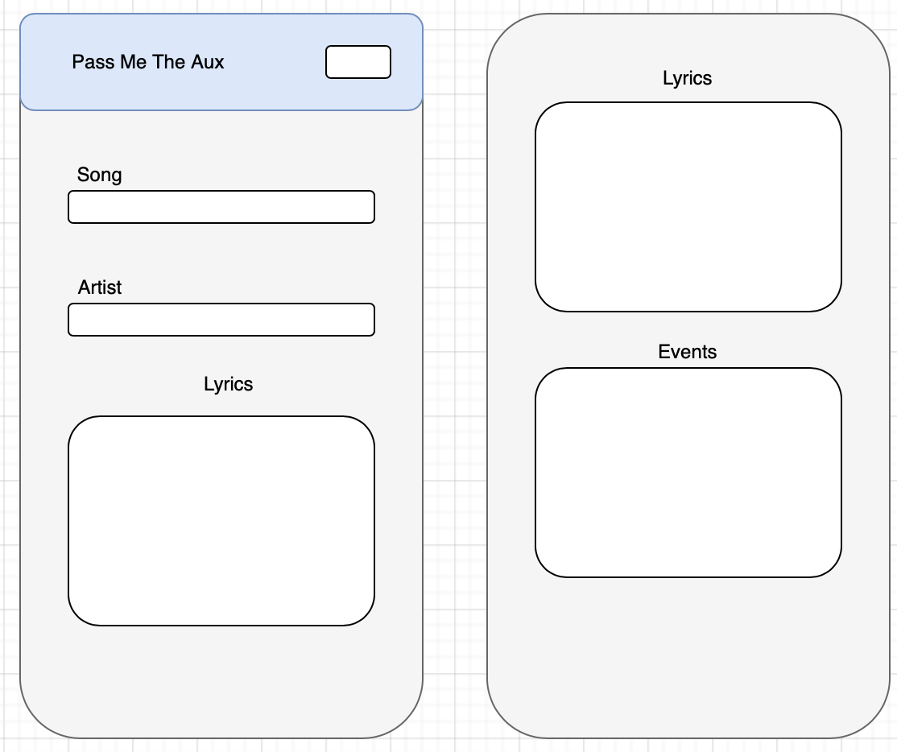
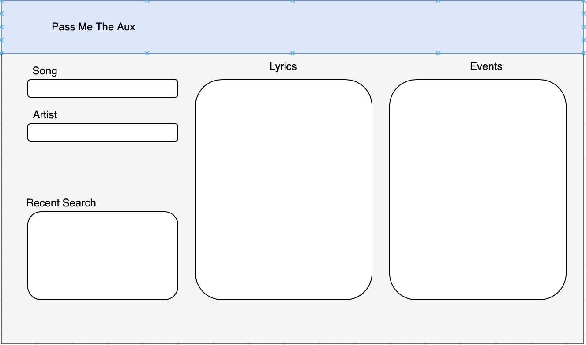

# Pass Me The AUX

## Description
A Music app that lets you see the lyrics of a song and future events for the artist of that song

## User Story
AS A music lover who listens to new songs everyday
I WANT to find information on the new artists I like: lyrics, genre, upcoming events
SO THAT I can buy tickets to their next concert and sing along to the songs

## Chosen APIs
- [SongKick](https://www.songkick.com/developer/search)
- [Lyrics.ovh](https://lyricsovh.docs.apiary.io/#reference/0/lyrics-of-a-song/search)

## Mock-Up

## Contact Info
jaclay94@gmail.com | 678-836-5753 | Atlanta, GA 
LinkedIn: https://www.linkedin.com/in/julian-clay-6a2bb71ba/
Github: https://github.com/jaclay1994

Juan P Echeverry - https://github.com/jpecheverryp

Aubrey Bennett - https://github.com/AubreyBennett

Uzochukwu Obeki - https://github.com/uzobeki

Uzo 
MIT License

Copyright (c) [2021] [Julian_Clay]

Permission is hereby granted, free of charge, to any person obtaining a copy
of this software and associated documentation files (the "Software"), to deal
in the Software without restriction, including without limitation the rights
to use, copy, modify, merge, publish, distribute, sublicense, and/or sell
copies of the Software, and to permit persons to whom the Software is
furnished to do so, subject to the following conditions:

The above copyright notice and this permission notice shall be included in all
copies or substantial portions of the Software.

THE SOFTWARE IS PROVIDED "AS IS", WITHOUT WARRANTY OF ANY KIND, EXPRESS OR
IMPLIED, INCLUDING BUT NOT LIMITED TO THE WARRANTIES OF MERCHANTABILITY,
FITNESS FOR A PARTICULAR PURPOSE AND NONINFRINGEMENT. IN NO EVENT SHALL THE
AUTHORS OR COPYRIGHT HOLDERS BE LIABLE FOR ANY CLAIM, DAMAGES OR OTHER
LIABILITY, WHETHER IN AN ACTION OF CONTRACT, TORT OR OTHERWISE, ARISING FROM,
OUT OF OR IN CONNECTION WITH THE SOFTWARE OR THE USE OR OTHER DEALINGS IN THE
SOFTWARE.